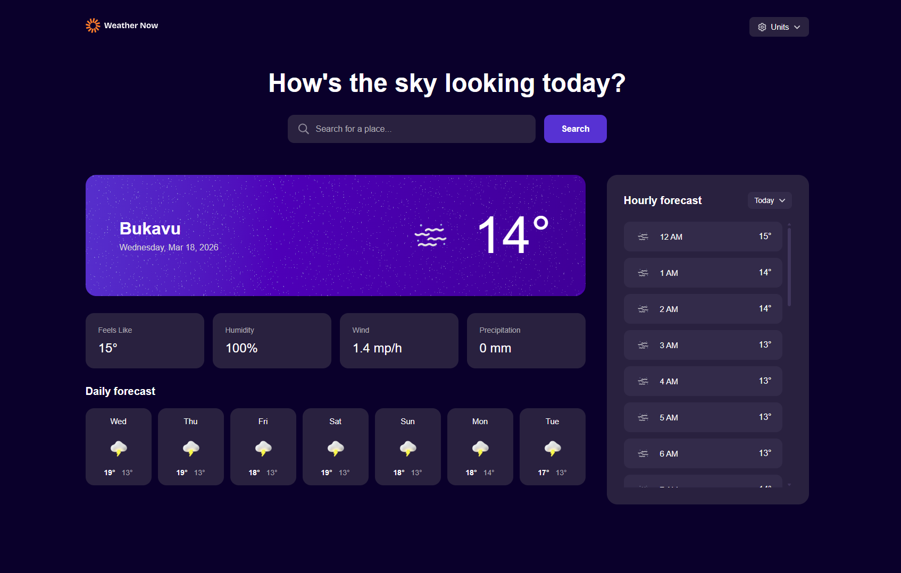

# Frontend Mentor - Weather app solution

This is a solution to the [Weather app challenge on Frontend Mentor](https://www.frontendmentor.io/challenges/weather-app-K1FhddVm49). Frontend Mentor challenges help to improve coding skills by building realistic projects.



## Table of contents

- [Overview](#overview)
  - [The challenge](#the-challenge)
  - [Links](#links)
- [My process](#my-process)
  - [Built with](#built-with)
  - [What I learned](#what-i-learned)
  - [Continued development](#continued-development)
  - [Useful resources](#useful-resources)
  - [AI Collaboration](#ai-collaboration)
- [Author](#author)

## Overview

### The challenge

Users should be able to:

- Search for weather information by entering a location in the search bar
- View current weather conditions including temperature, weather icon, and location details
- See additional weather metrics like "feels like" temperature, humidity percentage, wind speed, and precipitation amounts
- Browse a 7-day weather forecast with daily high/low temperatures and weather icons
- View an hourly forecast showing temperature changes throughout the day
- Switch between different days of the week using the day selector in the hourly forecast section
- Toggle between Imperial and Metric measurement units via the units dropdown
- View the optimal layout for the interface depending on their device's screen size
- See hover and focus states for all interactive elements on the page
- Experience appropriate UI feedback including loading spinners and empty/error states when searching

### Links

- Solution URL: [Weather App solution](https://your-solution-url.com)
- Live Site URL: [Weather App](https://freedev-group.github.io/weather-app-main-Prince/)

## My process

### Built with

- Semantic HTML5 markup
- CSS custom properties
- Flexbox
- CSS Grid
- Mobile-first workflow
- Vanilla JavaScript

### What I learned

During this project, I significantly improved my ability to create complex, responsive layouts that strictly adhere to professional design specifications. Working on this weather application helped me reinforce several key concepts:

1. **State Management in Vanilla JS**: I handled various UI states such as loading indicators, "no results found", and API error handling perfectly using just Vanilla JavaScript.
2. **Refining the UI/UX**: I implemented sophisticated design details, like substituting standard radio buttons with custom checkmarks for the unit selection (Metric vs Imperial), and ensuring loading spinners are perfectly centered alongside their text.
3. **Responsive Design**: Translating the provided desktop and mobile designs into a seamless, responsive layout using modern CSS features like Flexbox and CSS Grid.

```js
// Managing UI states dynamically based on the fetch process
function showLoadingState() {
  weatherContainer.innerHTML = '<div class="loading-spinner"></div>';
  // Centralizing the spinner for better user experience
}
```

```css
/* Flexbox, Position, and Transform were crucial for perfect center alignment, especially for loading states */
.loading-container {
  position: absolute;
  top: 50%;
  left: 50%;
  transform: translate(-50%, -50%);
  display: flex;
  flex-direction: column;
  justify-content: center;
  align-items: center;
  gap: 1rem;
}

/* CSS Grid was heavily used to seamlessly structure the responsive panels and forecast lists */
.weather-stats-grid {
  display: grid;
  grid-template-columns: repeat(auto-fit, minmax(200px, 1fr));
  gap: 16px;
}
```

### Continued development

In future projects, I want to continue focusing on:

- Enhancing Web Accessibility (A11y) to carefully manage focus states and ensure dynamic updates are announced effectively by screen readers.
- Exploring more advanced architectural patterns for organizing Vanilla JavaScript codebase.
- Adding subtle micro-interactions and animations (for instance, when weather widgets appear) to make the experience feel even more premium.

### Useful resources

- [MDN Web Docs](https://developer.mozilla.org/) - A fundamental reference during development for JavaScript methods and CSS best practices.
- [CSS-Tricks](https://css-tricks.com/) - A great resource when debugging and structuring CSS layouts like Flexbox and Grid.
- [Open meteo API](https://open-meteo.com/en/docs/) - A free weather API that provides weather data for any location in the world.
- [w3 schools](https://www.w3schools.com/CSS/) - A great resource for learning CSS and JavaScript.

### AI Collaboration

- I utilized an Agentic AI assistant as a collaborative pair-programmer throughout this project.
- It was deeply involved in helping me refine the HTML/CSS semantics and layout to accurately match the original design files.
- We worked together to implement robust features like the custom unit toggle drop-down (with checkmarks) and gracefully handling search states (e.g., when no results are found).
- Using AI allowed me to discuss trade-offs in implementation details, improving my ability to maintain clean code and a professional UI architecture.

## Author

- GitHub - [Hacp0012](https://github.com/hacp0012)
- Frontend Mentor - [@hacp0012](https://www.frontendmentor.io/profile/hacp0012)
